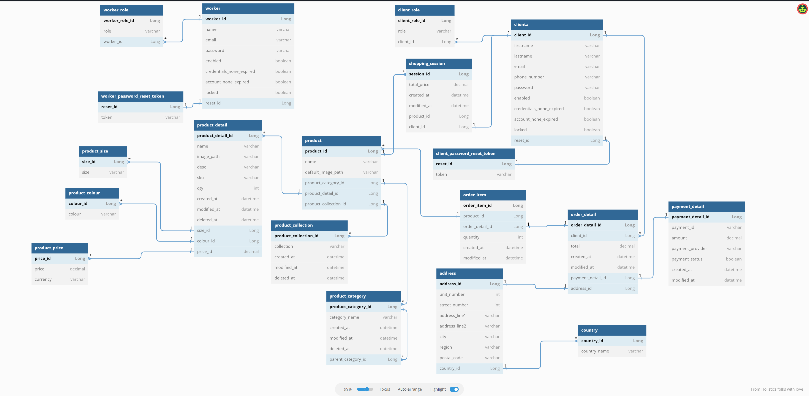

# Sara Brand Server
Server side code for Sara Brand e-commerce. Will become a private repo on completion of product relationship

### Technologies Thus Far
* Java 17
* Spring Boot
* MySQL and Redis
* Flyway Migration
* Unit test JUnit and Mockito
* Integration test using test containers

### Schema
This is the rough (subject to change) schema of what I am going for. Note I will not be saving credit card information

### Reference Documentation

For further reference, please consider the following sections:

* [Official Apache Maven documentation](https://maven.apache.org/guides/index.html)
* [Spring Boot Maven Plugin Reference Guide](https://docs.spring.io/spring-boot/docs/3.1.0/maven-plugin/reference/html/)
* [Create an OCI image](https://docs.spring.io/spring-boot/docs/3.1.0/maven-plugin/reference/html/#build-image)
* [Spring Boot Testcontainers support](https://docs.spring.io/spring-boot/docs/3.1.0/reference/html/features.html#features.testing.testcontainers)
* [Testcontainers MySQL Module Reference Guide](https://www.testcontainers.org/modules/databases/mysql/)
* [Spring Web](https://docs.spring.io/spring-boot/docs/3.1.0/reference/htmlsingle/#web)
* [Spring Data Redis (Access+Driver)](https://docs.spring.io/spring-boot/docs/3.1.0/reference/htmlsingle/#data.nosql.redis)
* [Spring Security](https://docs.spring.io/spring-boot/docs/3.1.0/reference/htmlsingle/#web.security)
* [Spring Data JPA](https://docs.spring.io/spring-boot/docs/3.1.0/reference/htmlsingle/#data.sql.jpa-and-spring-data)
* [Spring Boot DevTools](https://docs.spring.io/spring-boot/docs/3.1.0/reference/htmlsingle/#using.devtools)
* [Spring Session](https://docs.spring.io/spring-session/reference/)
* [Validation](https://docs.spring.io/spring-boot/docs/3.1.0/reference/htmlsingle/#io.validation)
* [Testcontainers](https://www.testcontainers.org/)

### Guides

The following guides illustrate how to use some features concretely:

* [Building a RESTful Web Service](https://spring.io/guides/gs/rest-service/)
* [Serving Web Content with Spring MVC](https://spring.io/guides/gs/serving-web-content/)
* [Building REST services with Spring](https://spring.io/guides/tutorials/rest/)
* [Accessing data with MySQL](https://spring.io/guides/gs/accessing-data-mysql/)
* [Messaging with Redis](https://spring.io/guides/gs/messaging-redis/)
* [Securing a Web Application](https://spring.io/guides/gs/securing-web/)
* [Spring Boot and OAuth2](https://spring.io/guides/tutorials/spring-boot-oauth2/)
* [Authenticating a User with LDAP](https://spring.io/guides/gs/authenticating-ldap/)
* [Accessing Data with JPA](https://spring.io/guides/gs/accessing-data-jpa/)
* [Validation](https://spring.io/guides/gs/validating-form-input/)